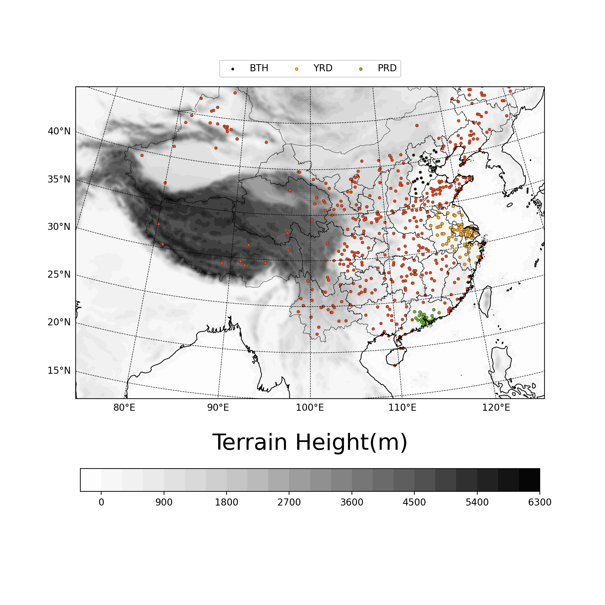

# Stragtegy on VOC assimilation  

## 1. Introduction

Volatile organic compounds (VOCs) have been known for their active role in photochemical process as being major precursors of secondary PM2.5, NOx, troposhere ozone[@Wu_2018], and thus China's Ministry of Ecology and Environment (MEE) has listed volatile organic compounds (VOCs) among the key pollutants to be controlled in the series plans since 2013. Chemical Transport Model (CTM) is powerful tool to simulate atmosphere pollution and support political desicions, but VOCs in CTM are far from being fully simulated. Errors come from various part, (这里我们需要一些具体的对于VOCs simulation缺陷的描述). Considering their important role in precursors for many pollutions, and their great uncertainty in CTM simulation, tackling VOCs uncertainty in CTMs is critical to improve forecast.(这里句子不通顺...)

Data assimilation has achieved great success in reducing uncertainty in meteorological modelling since Last centery, and in recent years has also been proven as a useful method in CTM. One major difference in meteorology model assimilation and CTM assimilation is the additional emission field in CTM. Unlike meteorology model, in which initial errors have determinant influence in error growing, in CTM, emission error plays an equal role as initial state variable error, or even more crucial, as initial error fading over time[@Sandu_2011]. Thus, assimilating IC and emission at the same time is needed, and will get a better assimilation performance compared to only assimilate IC/Emission[@Elbern_2007; @Tang_2011].

But, when it comes to assimilating VOCs, many difficulties occure. Firstly, observation of VOCs is rare, compared with the six main pollution species(PM2.5, PM10, Ozone, NO2, SO2, CO) which, according to MEP, have over 1500 station across china providing hourly observation. Even we conduct several VOCs observation by ourselves, the short lifetime of VOCs will also limit the localization scale in assimilation[@Koohkan_2013], making it hard to be directly used in models with large domain, and also make it hard to do a validation. Secondly, there exist plenty of VOCs species in model state variable, each possess its own chemical character, and their classification differ among several gas-phase chemical mechanism. What's worse, VOCs have highly non-linear reactions among themselves, Ozone, NOx, SOA(PM2.5), and many other state variables. In an assimilation framework with several linear approximation, it will make assimilation result diverge quickly from truth[@Tang_2016]. All of these make VOCs assimilation hard. Previous works tend to view all VOCs species as an unit, and assimilate it without considering the differences between VOC species[@Tang_2011; @Ma_2019; @Xing_2020]. This simplification will certainly bring in extra uncertainly, and make this kind of VOC assimilation not work or even worse in some cases.

## waste version of intro!

Troposhere ozone has been viewed as a critical component in air pollution for being a threat to human body. Recent years, due to active industrial activities, rapid urban construction, dense population, and many other factors, the coastal city clusters have not only become a catalyst for China's economic takeoff, but also brought serious air quality problems,  and troposphere ozone pollution is a typical example. This demands for higher accuracy in air quality numerical model prediction. (Note: need much more polish ... )

但是，因为源排放的不确定性，参数化方案，气象场与化学场的初始/边界条件误差等问题，许多空气质量模型都不能达到令人满意的预报精度(warning: suspicious, need accurate cite)。数据同化在air quality model中已经有了广泛的应用。Filtering approach [@Schwartz_2012; @Pagowski_2012; @Peng_2017, @Kou_2021]，Variational [@Elbern_2007; @Pagowski_2010; @Liu_2011], hybird method [@Schwartz_2014]. 源排放对空气质量模式的预报精度影响巨大[@Sandu_2011]，通过同时同化chem ic and emission，可以更好地的改进模式的预报结果[@Elbern_2007]。top-down的源排放处理。

当视角转变到Ozone预报上，情况将更加复杂，因为控制模式Ozone预报的factor种类繁多，模式气相化学方案，输运过程，前体物源排放都会对Ozone造成影响，其中，源排放对于Ozone预报的影响格外明显[@Monks_2015]。城市短期Ozone预报的一个重要的不确定性来源就是前体物(mainly,NOx,CO,NMVOCs)的源[@Tang_2011; @Tang_2010]。在Ozone的前体物中，NMVOCs具有很大的不确定性，这种不确定性不仅体现在emission的总量上，也体现在NMVOC speciation上[@Li_2017]。具体来说，模式中不同的气相化学方案都对VOCs进行了不同的分类(lumped together according to their similarities in chemical structure or reactivity), but these speciation almost always differ from inventories, which introduces extra uncertainty. This speciation uncertainty will greatly affect model performance, and many efforts have been devoted to construct a better NMVOC speciated emission, both bottom-up[@Li_2014] and top-down[@Choi_2022]. But in data assimilation, uncertainty of NMVOCs speciation haven't got enough attention. Previous studies usually treat NMVOCs as a unity and ignore differences between different NMVOC species.(eg. [@Tang_2011; @Ma_2019; @Xing_2020]). (......) NMVOC is critical for ozone forecasting, and current assimilation method still remains large uncertainty.

目前还没有建立NMVOCs的常规业务化观测，并且据[@Koohkan_2013]，由于其生命周期很短，限制了VOCs的站点观测同化的空间半径，在使用空间分辨率较大的模式时，即使有稀疏的观测也难以达到理想的效果。这使得我们现阶段只能使用其他的常规观测污染物来尝试同化VOCs。

同时同化VOCs的concentration field and emission field并且对VOCs做出区分，这是我们的独特性。并且，我们的方法可以easily apply to other gas-phase chemical mechanisms(可以说hold true for other VOC speciation吗？似乎不能).

## 2. Model configurations and data assimilation system

Version 3.6.1 of the WRF-Chem model was used, which is an 'online' model with fully-coupled chemical and meteorological fields[@Grell_2005].This means a perturb in meteorological fields can have impact on chemical fields, and vise versa. The EnSRF[@Whitaker_2002] with its expansion to chem and emission component[@Schwartz_2014; @Peng_2017] is chosen to construct the data assimilation system. Section 2.1 and 2.2 will expand the two settings more specificly.

### 2.1. WRF-Chem model setting

Table1 for wrf-chem paramenterization setting. See [@Peng_2018] for an example.
Table2 for RADM2 NMVOCs speciation in model. (14 VOCs we use).

Figure for domain setting and chem observation station distribution.

The update of source emissions through assimilation of chemical observations follows[@Peng_2017], detailed description will not expand here.

### 2.2. data assimilation setting

## 3. Observations

### 3.1. Meteo

The conventional observations (<http://www.emc.ncep.noaa.gov/mmb/data_processing/prepbufr.doc/table_2.htm>) from the National Centers for Environmental Prediction (NCEP) Global Data Assimilation System (GDAS), which include all in situ observations and cloud motion vectors, are assimi- lated every 6 hr.

### 3.2. Chem

The hourly surface conventional air pollutant observations (i.e., PM2.5, PM10, NO2, SO2, O3 and CO) were from the Ministry of Ecology and Environment of China (MEE; <http://106.37.208.233:20035/>). [@Kou_2021]

### 3.3. Emission

Mainland China: The hourly prescribed anthropogenic emission is obtained from the Multi‐resolution Emission Inventory for China (MEIC v1.3) [@Li_2017; @Zheng_2018] in July 2017, which is the most updated dataset. In areas out of mainland china, we use EDGARv6.1 in July 2017.

## 4. Experiment Design

### 4.1. 30-day free forecast

### 4.2 VOC Factor

Define:
$$
factor = corr*(norm(conc)-norm(emiss))
$$

### 4.3. cycling and forecast setting

We set Meteo Observation assimilate Meteo state variable, six main air pollution's Observation assimilate their own model state variable and emission scaling factor as control experiment(CTRL), which has been shown to be capable of generating relatively good results in analysis and forecast[@Peng_2020]. (注意，这里最好说的更详细一些，在哪些方面(pm25,so2,no2)得到了改进？)

Previous works tend to use ozone observation to assimilate VOCs[@Tang_2011; @Ma_2019; @Xing_2020]. 

This Table describle what we do in VOCs. Columns are expt name, and rows are VOC names we use in model, cell text is observation used to assimilate row VOC in column expt.

|      | CTRL | O3_AllVOC | O3_AvgVOC | Max_AvgVOC | All_AvgVOC     |
| ---- | ---- | --------- | --------- | ---------- | -------------- |
| KET  |      | O3        | O3        | PM25       | PM25/NO2/CO/O3 |
| HCHO |      | O3        | O3        | CO         | PM25/NO2/CO/O3 |
| TOL  |      | O3        |           | NO2        | PM25/NO2/CO    |
| OLI  |      | O3        | O3        | O3         | O3             |
| ALD  |      | O3        |           | CO         | PM25/NO2/CO    |
| HC8  |      | O3        |           |            | NO2            |
| HC5  |      | O3        |           |            | NO2            |
| XYL  |      | O3        |           |            |                |
| ETH  |      | O3        |           |            |                |
| HC3  |      | O3        |           |            |                |
| OLT  |      | O3        |           |            |                |
| ORA2 |      | O3        |           |            |                |
| ISO  |      | O3        |           |            |                |
| CSL  |      | O3        |           |            |                |

## 5. Results

## 6. Summary and discussion

## 一些可以用到的结论

1. Ozone预报的一个重要的不确定性来源就是前体物的源。

   Precursor emissions have been pointed out as the important uncertainty sources of ozone forecast by many previous studies (Carmichael et al., 2008; Constantinescu et al., 2007b; Hanna et al., 1998)

2. 在城市的短期的Ozone预报中，前体物的源是除Ozone IC之外的最主要的来源As reported by Tang et al. (2010b), precursor emissions are the most important uncertainty sources for short-term ozone forecast over urban areas beside ozone initial conditions, in contrast to the short-term ozone forecast over suburban areas where the precursor emissions show minor role

3. VOCs的观测由于其生命周期很短，限制了同化的空间半径。(Koohkan 2013)it is shown that the use of in situ observations using a sparse monitoring network to estimate emissions of isoprene is inadequate because its short chemical lifetime significantly limits the spatial radius of influence of the monitoring data

4. 根据Li 2014，MEIC源根据不同的气相化学方案区分了不同的NMVOCs源。如果没有对NMVOCs进行更加细致的同化操作，实际上是浪费了这些信息。

5. Sandu 2011 Elbern2007 都在说emission是control variable，这对Ozone也一样。

6. It has been shown that VOC and
    NOx emissions can affect the production or loss of each other
    (Marais et al., 2012; Wolfe et al. 2016; Valin et al., 2016;
    Souri et al., 2020a). [@Souri_2020]

7. In particular, there is increasing evidence that sulfur dioxide (SO2) can modulate SOA formation and composition (Ye et al., 2018; Stangl et al., 2019; Liu et al., 2017).

8. These all indicated that in the conditions of stronger solar radiations (summer) and low-middle aerosol loads, VOCs chemistry played the important role in PM2.5 increasing through contributing SOA; See[The impacts of VOCs on PM2.5 increasing via their chemical losses estimates: A case study in a typical industrial city of China - ScienceDirect](https://www.sciencedirect.com/science/article/pii/S1352231022000437?via%3Dihub)This Paper for more detailed infomation. 这个可以解释一下为什么我们选择2022 July Case
